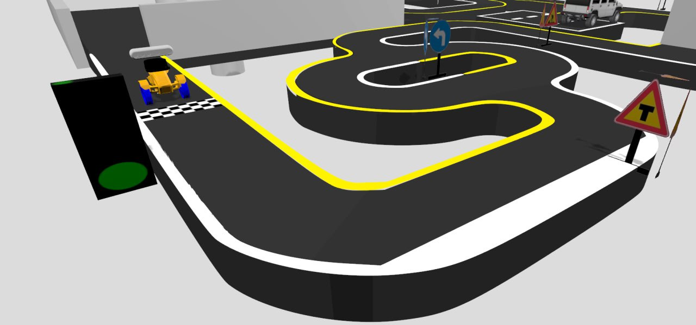
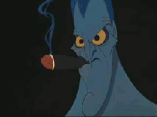
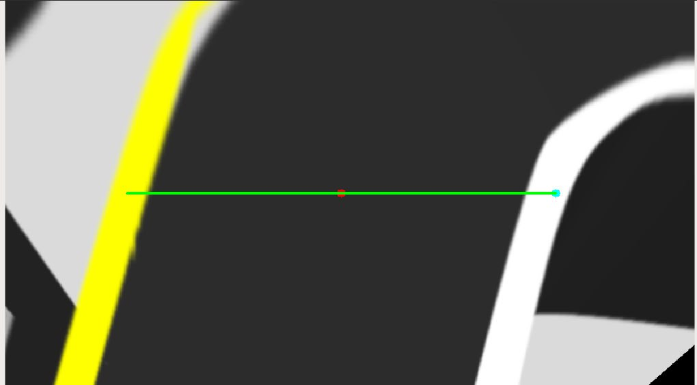
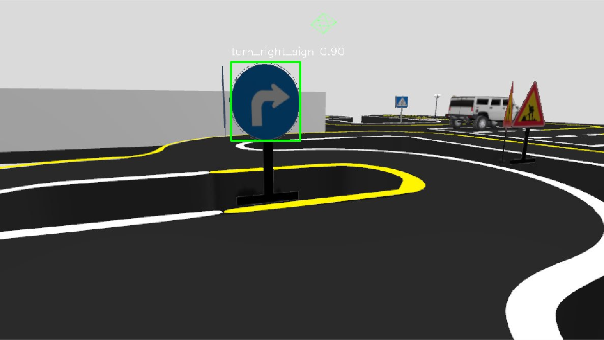
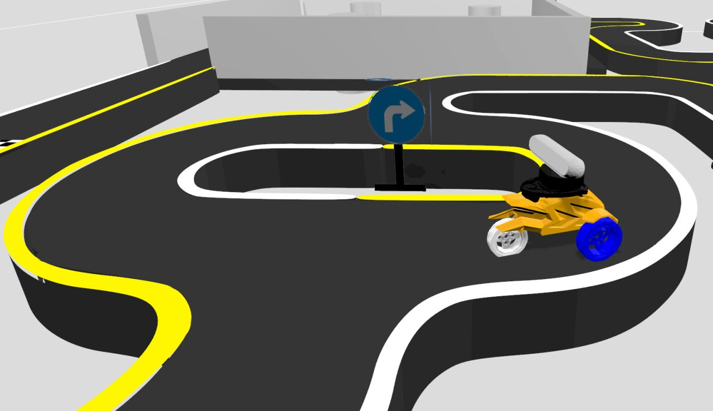
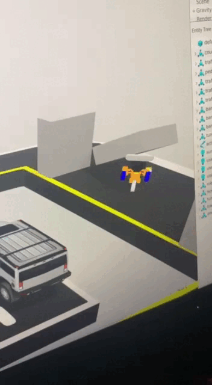

# ROS competition 2024


## Состав команды papiROSa:

<div style="display: flex; align-items: center;">
  
  <div>

    Васильев Михаил  
    Золотых Игорь  
    Пыжьянов Егор  
    Шевцов Михаил  

  </div>
</div>

## Светофор
<div style="display: flex; align-items: center;">
  
  <div>

    Преобразуем изображение с камеры в формат HSV 
    для определения зеленого цвета на картинке.
    Если такой есть - начинаем движение

  </div>
</div>

<!-- 

Преобразуем изображение с камеры в формат HSV для определения зеленого цвета на картинке.
Если такой есть - начинаем движение -->

## Движение


Удержание в полосе реализовано за счет PID-регулятора.
Находятся точки на белой и желтой полосе на проекции изображения с камеры робота(вид сверху), и робот старается держаться центра отрезка, соединяющего эти две точки.
Но мы добавили определенные смещения относительно этого центра, чтобы пройти некоторые участки трассы без проблем.

<div style="display: flex; align-items: center;">
  
  <div>

    Удержание в полосе реализовано за счет PID-регулятора.
    Находятся точки на белой и желтой полосе на проекции изображения с камеры робота(вид сверху), и робот старается держаться центра отрезка, соединяющего эти две точки.
    Но мы добавили определенные смещения относительно этого центра, чтобы пройти некоторые участки трассы без проблем.

  </div>
</div>

## Перекресток



С помощью YOLOv5 мы обнаруживаем знак перекрестка, и немного меняются характеристики робота(скорости).
Далее классифицируется знак поворота(направо или налево), и робот с учетом некоторых корректировок в зависимости от знака начинает движение в нужную сторону.

## Стены


Робот очень сильный


## Как запустить

Запуск симуляции (1 терминал)
```
 ros2 launch robot_bringup autorace_2023.launch.py
```

Запуск нашего пакета для прохождения (2 терминал)
```
ros2 launch autorace_core_papiROSa autorace_core.launch.py
```

Запуск рефери (3 терминал)
```
ros2 run referee_console mission_autorace_2023_referee
```